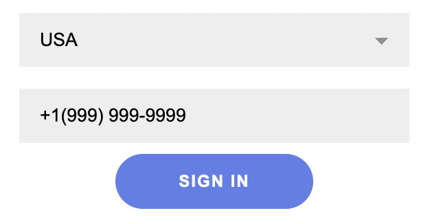

# Phone Auth

Simple Phone Authorization using **GoLang** and **JavaScript**

---

## Technologies

- [](https://go.dev/)
- [](https://wikipedia.org/wiki/HTML) [](https://wikipedia.org/wiki/CSS)
- [](https://www.javascript.com/)

---

## Preview

- Home Screen


- Choose county for the phone mask


- Enter phone number. It's automaticly formatted with to the phone mask

<div>
    
    
</div>

- Existing Phone Number (the name is taken from API, in the example it is Nikita)


- Invalid Phone Number (the error is also taken from API)


---

## Using and Installation

### Instalation

- Clone or download this GitHub repository
```bash
git clone url
```
- Navigate to the project folder
```bash
cd GoJsPhoneAuth
```

### Run BackEnd

- Navigate to the backend directory
```bash
cd backend
```
- Build GoLang Project (it is simple using Makefile)
```bash
make build
```
- Run the builded project file **apiserver** in **backend** directory

### Run FrontEnd

- Navigate to the frontend directory
```bash
cd frontend
```
- Open the file **index.html** in your browser

---

## Backend Endpoints

- To create a new user
(POST method)
```http
http://0.0.0.0:8000/user
```
    Params: {
        "name": "Example",
        "phone": "+123456789",
    }

- To get the user by phone number
(GET method)
```http
http://0.0.0.0:8000/user/{phone}
```

- To delete user by phone number
(DELETE method)
```http
http://0.0.0.0:8000/user/{phone}
```

---

## Have Fun :upside_down_face:

<div>
    
    
    
    
    
    
    
    
    
    
    
    
    
    
    
    
    
    
    
    
    
    
    
    
</div>